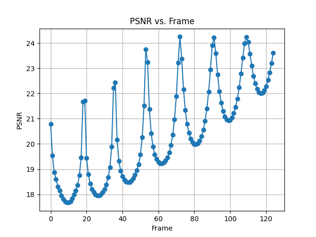
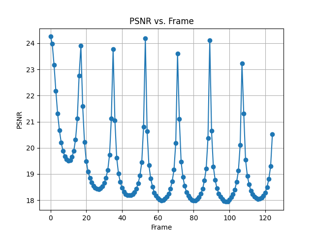
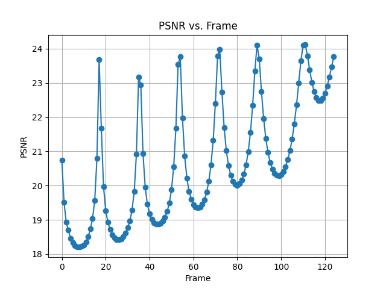

[](https://classroom.github.com/a/SdXSjEmH)
# EV-HW3: PhysGaussian

This homework is based on the recent CVPR 2024 paper [PhysGaussian](https://github.com/XPandora/PhysGaussian/tree/main), which introduces a novel framework that integrates physical constraints into 3D Gaussian representations for modeling generative dynamics.

You are **not required** to implement training from scratch. Instead, your task is to set up the environment as specified in the official repository and run the simulation scripts to observe and analyze the results.


## Getting the Code from the Official PhysGaussian GitHub Repository
Download the official codebase using the following command:
```
git clone https://github.com/XPandora/PhysGaussian.git
```


## Environment Setup
Navigate to the "PhysGaussian" directory and follow the instructions under the "Python Environment" section in the official README to set up the environment.


## Running the Simulation
Follow the "Quick Start" section and execute the simulation scripts as instructed. Make sure to verify your outputs and understand the role of physics constraints in the generated dynamics.


## Homework Instructions
Please complete Part 1–2 as described in the [Google Slides](https://docs.google.com/presentation/d/13JcQC12pI8Wb9ZuaVV400HVZr9eUeZvf7gB7Le8FRV4/edit?usp=sharing).


# Reference
```bibtex
@inproceedings{xie2024physgaussian,
    title     = {Physgaussian: Physics-integrated 3d gaussians for generative dynamics},
    author    = {Xie, Tianyi and Zong, Zeshun and Qiu, Yuxing and Li, Xuan and Feng, Yutao and Yang, Yin and Jiang, Chenfanfu},
    booktitle = {Proceedings of the IEEE/CVF Conference on Computer Vision and Pattern Recognition},
    year      = {2024}
}
```

## Jelly
### Parameter Adjustments

I conducted simulations by adjusting the following physical parameters individually:

| Parameter | Tested Values | Description |
|----------|---------------|-------------|
| `n_grid` | 25, 50 (base) | Grid resolution. Affects simulation granularity and speed. |
| `grid_v_damping_scale` | 1.2, 0.9999 (base)| Grid velocity damping. Controls energy dissipation. |
| `softening` | 0.2, 0.0 (base) | Controls sand cohesion and material breakup behavior. |
| `substep_dt` | 0.00005, 0.0001 (base) | Simulation timestep. Larger values are faster but may destabilize simulation. |

All other parameters were fixed to default baseline values when sweeping each target parameter.

### Simulation Videos & PSNR Results

Videos were rendered for each parameter variation. PSNR was computed per frame against the baseline (n_grid=100, softening=0.1, grid_v=1.0, substep_dt=0.00001):

| Variation | Video | PSNR Plot |
|----------|-------|-----------|
| Baseline | [Video](https://youtube.com/shorts/6VYwo9BbK-g?feature=share) | |
| n_grid=25 | [Video](https://youtube.com/shorts/qE8PSlkr_Rs?feature=share) |  |
| grid_v=1.2 | [Video](https://youtube.com/shorts/boUUBd0ddmA?feature=share) |  |
| softening=0.2 | [Video](https://youtube.com/shorts/8wJ5All_KE8?feature=share) |  |
| substep_dt=0.00005 | [Video](https://youtube.com/shorts/GGdMvFIF_GI?feature=share) |  |

## Sand
### Parameter Adjustments

I conducted simulations by adjusting the following physical parameters individually:

| Parameter | Tested Values | Description |
|----------|---------------|-------------|
| `n_grid` | 50, 100 (base) | Grid resolution. Affects simulation granularity and speed. |
| `grid_v_damping_scale` | 0.9999, 1.1 (base)| Grid velocity damping. Controls energy dissipation. |
| `softening` | 0.4, 0.1 (base) | Controls sand cohesion and material breakup behavior. |
| `substep_dt` | 0.00005, 0.00001 (base) | Simulation timestep. Larger values are faster but may destabilize simulation. |

All other parameters were fixed to default baseline values when sweeping each target parameter.

### Simulation Videos & PSNR Results

Videos were rendered for each parameter variation. PSNR was computed per frame against the baseline (n_grid=100, softening=0.1, grid_v=1.0, substep_dt=0.00001):

| Variation | Video | PSNR Plot |
|----------|-------|-----------|
| Baseline | [Video](https://youtube.com/shorts/Iu4sLNd4CZ8?feature=share) | |
| n_grid=50 | [Video](https://youtube.com/shorts/q7m8froIhK4?feature=share) |  |
| grid_v=0.9999 | [Video](https://youtube.com/shorts/nbGQ63hJUQw?feature=share) |  |
| softening=0.4 | [Video](https://youtube.com/shorts/1oNHmpT6kCc?feature=share) |  |
| substep_dt=0.00005 | [Video](https://youtube.com/shorts/urVpslL7sKQ?feature=share) |  |


## Key Takeaways and Findings (25%)

Through systematic parameter ablation, I discovered several important behaviors and design trade-offs in the PhysGaussian simulation system. Below is a detailed summary of our findings:

### 1. Grid Resolution (`n_grid`)

* **Lower values (e.g., 25 or 50)** speed up the simulation but lead to coarse particle interactions. I observed visually obvious aliasing and granularity in rendered images.
* **Higher values (e.g., 100)** significantly improve spatial accuracy and lead to higher PSNR, especially for scenes with sharp geometric features.
* However, simulation time increases quadratically or cubically due to the 3D grid size. There's a noticeable performance drop when increasing from 50 → 100.

### 2. Grid Velocity Damping (`grid_v_damping_scale`)

* This parameter controls how much momentum is retained on the grid.
* **Values too high (e.g., 1.2)** amplify velocity and often lead to simulation instability or explosive behavior—particles overshoot or oscillate uncontrollably.
* **Values just below 1 (e.g., 0.999 or 0.9999)** provide gentle damping, reducing high-frequency oscillations while maintaining motion smoothness.
* Proper damping improves convergence and realism, and often results in higher frame-to-frame consistency, reflected in more stable PSNR curves.

### 3. Material Softening (`softening`)

* This parameter is only applicable to Drucker–Prager-type materials (like sand or soil).
* **Lower values (e.g., 0.05)** result in a more cohesive and rigid appearance—particles resist breaking apart and maintain structure better.
* **Higher values (e.g., 0.2 or 0.4)** make the material more brittle or flow-like, with particles dispersing or collapsing more easily under force.
* Adjusting softening allowed us to mimic different granular behaviors such as packed dirt versus dry sand.

### 4. Substep Time (`substep_dt`)

* This directly affects both numerical stability and physical plausibility.
* **Larger substeps (e.g., 0.0001)** speed up computation but introduce integration errors—particles accelerate too quickly, leading to unnatural jumps or exaggerated motion. PSNR tends to drop as visual fidelity decreases.
* **Smaller substeps (e.g., 0.00001)** provide greater stability and accuracy but at the cost of computation time. PSNR consistently improved under small substep conditions.
* This tradeoff is critical when balancing quality and speed in real-time simulations.

### 5. Material Type Sensitivity

* I tested both `jelly` and `sand` as primary materials.
* Softening had no effect on jelly (elastic), as expected.
* Grid damping and substep timestep had a more pronounced visual and numerical impact on jelly than sand, due to its bouncier dynamics.
* The system properly handled different constitutive models depending on the material, which validates the parameter-specific behavior.
